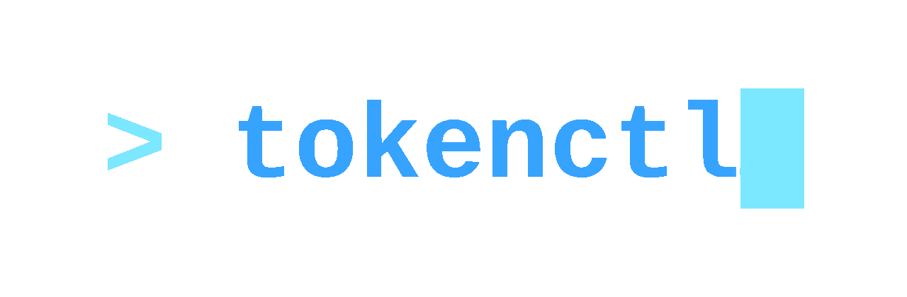
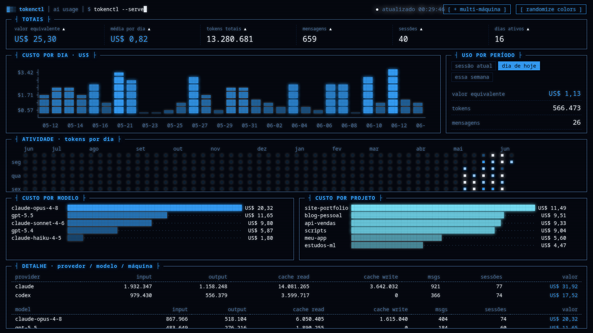
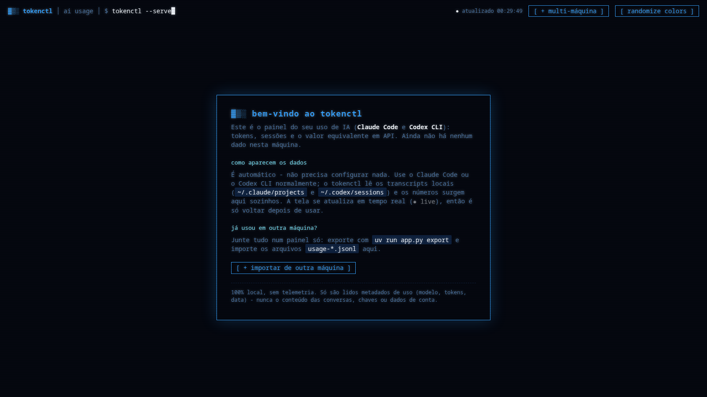

<p align="center">
  
</p>

# tokenctl - AI Usage Viewer

Dashboard web do seu uso de assistentes de IA - hoje **Claude Code** e **Codex CLI**:
tokens (input/output/cache), mensagens/sessões e o **valor equivalente em API**
(quanto custaria se o uso fosse pago por token), quebrado por **provedor, dia,
modelo, projeto e máquina**.

Os dados vêm dos transcripts locais de cada ferramenta:
- Claude Code: `~/.claude/projects/**/*.jsonl`
- Codex CLI: `~/.codex/sessions/**/rollout-*.jsonl` (eventos `token_count`)

Como os dois rodam em plano de assinatura, o "valor" é o equivalente em API - útil
pra ver o quanto o plano está rendendo. O dashboard se **atualiza sozinho**: o
backend reparseia os dados a cada request e o front faz *polling* automático
(indicador "● live" no header), então novos usos aparecem sem reiniciar nada.

## Demonstração

Tour da aplicação:

<p align="center">
  
</p>

<p align="center">
  
</p>

<p align="center">
  
</p>

## Segurança e privacidade

**100% local, sem telemetria.** O `tokenctl` só lê arquivos no seu computador e
sobe um servidor em `127.0.0.1` (localhost) - não envia nada para lugar nenhum,
não tem analytics e não faz nenhuma chamada de rede de saída.

**Só lê informações de uso.** De cada transcript ele extrai apenas os metadados de
consumo: provedor, modelo, data/hora, contagem de tokens (input/output/cache) e o
nome da pasta do projeto. Para agrupar os números, guarda também o *hostname* da
máquina e o id (aleatório) da sessão.

**O que ele NÃO lê:** o conteúdo das suas conversas (prompts/respostas), chaves de
API, tokens de acesso, e-mail, id de conta/usuário ou qualquer credencial. Esses
campos simplesmente não são abertos nem exportados.

O export para juntar várias máquinas (`usage-<host>.jsonl`) carrega exatamente
esses mesmos metadados de uso - **nunca** o texto das conversas.

## Uso local (uma máquina)

```bash
cd ~/tokenctl
uv run app.py serve        # abre em http://127.0.0.1:8888
```

## Unificar várias máquinas (manual)

Cada máquina exporta só um resumo **enxuto** (`usage-<host>.jsonl`: modelo, tokens,
data, projeto, máquina - **sem o conteúdo das conversas**). Você junta esses
arquivos no diretório `data/` da máquina que roda o dashboard; o viewer mescla
tudo e deduplica por `message.id+requestId`, então nunca conta a mesma mensagem
duas vezes.

### 1. Em cada máquina secundária

```bash
uv run app.py export        # gera data/usage-<host>.jsonl desta máquina
```

### 2. Levar o arquivo para a máquina do dashboard

A forma mais fácil: no painel, clique em **`[ + multi-máquina ]`** (canto superior
direito) e arraste os `usage-*.jsonl` - pode soltar vários de uma vez. Eles são
gravados em `data/` e o painel já mostra os dados.

Ou copie manualmente para o `data/` da máquina que serve o painel - por `scp`,
Syncthing, pen drive, ou o que preferir. Por exemplo:

```bash
scp data/usage-*.jsonl usuario@maquina-do-dashboard:~/tokenctl/data/
```

Não há repositório git de dados nem push automático: é só deixar os `.jsonl` em
`data/`. Se quiser automatizar, aponte uma pasta sincronizada (ex.: Syncthing)
como `DATA_DIR`.

### 3. Ver o dashboard

```bash
uv run app.py serve    # sobe o painel já unificado com tudo que está em data/
```

A aba **"Por máquina"** aparece sozinha quando há dados de mais de um computador.

## Variáveis de ambiente

| Var                   | Padrão                  | O que faz                              |
|-----------------------|-------------------------|----------------------------------------|
| `CLAUDE_PROJECTS_DIR` | `~/.claude/projects`    | Transcripts do Claude Code nesta máquina |
| `CODEX_SESSIONS_DIR`  | `~/.codex/sessions`     | Rollouts do Codex CLI nesta máquina    |
| `DATA_DIR`            | `./data`                | Pasta com os exports das outras máquinas |
| `HOST` / `PORT`       | `127.0.0.1` / `8888`    | Endereço do servidor                   |

O front aceita `?poll=<ms>` na URL para ajustar o intervalo de atualização
automática (padrão 15000 ms).

## Adicionar outros modelos / CLIs

Hoje o tokenctl entende **Claude Code** e **Codex CLI**, mas a arquitetura é
genérica: cada fonte é só uma função que lê os logs locais daquela ferramenta e
devolve **registros num formato unificado**. Para suportar qualquer outro
assistente (Gemini CLI, aider, opencode, etc.) basta escrever um parser novo.

### Como funciona

Todo o dashboard trabalha em cima de um dicionário por requisição/mensagem:

```python
{
  "provider": "claude",        # nome da ferramenta/provedor (vira a aba)
  "model": "claude-opus-4-8",  # id do modelo
  "ts": "2026-06-14T10:00:00Z",# timestamp ISO-8601
  "project": "tokenctl",       # nome da pasta do projeto
  "session": "abc-123",        # id da sessão (qualquer string estável)
  "machine": "meu-pc",         # hostname (preenchido para você)
  "input": 1200, "output": 340,
  "cache_read": 0, "cache_write": 0,
  "tokens": 1540,              # soma do que quiser contar
  "cost": 0.0123,              # valor equivalente em API (USD)
  "uid": "gem:abc-123:42",     # id único p/ deduplicar (NÃO repetir)
}
```

### Passos

1. **Tabela de preços + função de custo** (USD por 1M tokens), espelhando
   `ANTHROPIC_PRICING`/`OPENAI_PRICING` e `anthropic_cost()`/`openai_cost()`.
2. **Um gerador `iter_<ferramenta>_records(machine)`** que lê os logs locais e
   dá `yield` em dicionários no formato acima - igual a `iter_claude_records` /
   `iter_codex_records`.
3. **Ligue a fonte** em `load_records()`:

   ```python
   for rec in iter_gemini_records(machine):
       add(rec)
   ```

O `uid` é o que evita contagem dobrada quando o mesmo dado vem de várias
máquinas - use algo determinístico (ex.: `f"gem:{session}:{n}"`). O `cost` é só
o valor equivalente em API; se não souber o preço, pode deixar `0.0`.

Esqueleto de um parser novo:

```python
def gemini_dir() -> Path:
    return Path(os.environ.get("GEMINI_DIR", Path.home() / ".gemini"))

def iter_gemini_records(machine: str):
    d = gemini_dir()
    if not d.is_dir():
        return
    for path in d.rglob("*.log"):          # ajuste ao formato real
        for obj in _iter_lines(path):      # _iter_lines já lê JSONL com segurança
            # ... extraia model, tokens, ts, session do seu log ...
            yield {
                "provider": "gemini", "model": model, "ts": ts,
                "project": project, "session": session, "machine": machine,
                "input": inp, "output": out, "cache_read": 0, "cache_write": 0,
                "tokens": inp + out,
                "cost": gemini_cost(model, inp, out),
                "uid": f"gem:{session}:{n}",
            }
```

### Exemplo: Gemini CLI

O [Gemini CLI](https://github.com/google-gemini/gemini-cli) (open source) **não**
grava um transcript de uso por padrão - ele expõe o consumo via OpenTelemetry, que
vem **desligado**. Para o tokenctl conseguir ler, ative o log local em
`~/.gemini/settings.json`:

```json
{ "telemetry": { "enabled": true, "target": "local", "outfile": ".gemini/telemetry.log" } }
```

A partir daí, os tokens aparecem no `.gemini/telemetry.log` nas métricas
`gemini_cli.api_response` (`input_token_count`, `output_token_count`,
`cached_content_token_count`, `model`) e `gemini_cli.token.usage`. Seu parser lê
esse arquivo e mapeia esses campos para o registro unificado acima.

## Preços

Tabela em `PRICING` no `app.py` (USD por 1M tokens, input/output). Cache: leitura
0,1× input, escrita 1,25× (5m) / 2× (1h). Ajuste se algum modelo mudar de preço.
